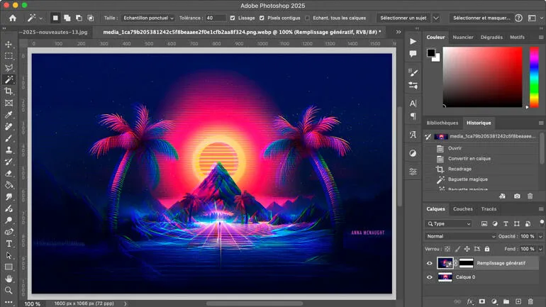

# 🚀 **photoshop cracked** | **adobe photoshop crack**

Unleash the power of innovation with **photoshop cracked**, a cutting-edge solution designed for unmatched **software quality** and unwavering reliability. By integrating advanced features such as real-time monitoring and automated optimization, **photoshop cracked** ensures your projects are not only efficient but also future-proof. Empower your team with tools that prioritize performance and precision, all while maintaining an intuitive user experience.

## 🛠️ Support for **photoshop cracked**

Need help with **photoshop cracked**? We've got you covered! Below is everything you need to ensure a smooth experience:

### 🚀 Technical Support
Our dedicated team is here to assist you with any technical issues related to **photoshop cracked**. Whether it's troubleshooting or feature inquiries, our support is reliable and prompt.

### 📚 Documentation & Resources
Dive into comprehensive guides and tutorials designed to help you make the most out of **photoshop cracked**. Our detailed documentation ensures that all your questions are answered.

- **Primary Resource**: [Official Docs](#)
- **Additional Guides**: Explore how-to articles and best practices for **adobe photoshop free**

### 💬 Community Forums
Join our vibrant community forums where users share tips, solve problems together, and discuss the latest updates on **photoshop cracked**. Your voice matters—engage and contribute!

### 🔧 Updates & Maintenance
We prioritize stability and innovation. Regular updates ensure that **photoshop cracked** remains secure, efficient, and up-to-date. Stay informed about upcoming changes through our release notes.

---

---

### Take Action Now!
Don't hesitate to reach out or explore further. Let's build something amazing together with **photoshop cracked**.

## Getting Started with **photoshop crack 2025**

Welcome to **photoshop crack 2025**! Below is a step-by-step guide to help you get started quickly and efficiently. Follow these simple steps to download, install, configure, and begin using **photoshop crack 2025** for your projects.

1. 📥 **Download and Installation**
   - Visit the official website or repository page of **photoshop crack 2025**.
   - Download the latest stable release suitable for your operating system.
   - Run the installer or extract the files if it’s a compressed package.
   - Ensure all dependencies (if any) are installed as specified in the documentation.

2. 🔧 **Initial Setup**
   - Once installed, open the application or run the setup script provided.
   - Follow the on-screen instructions to complete the initial setup process.
   - If prompted, create an account or log in with your existing credentials.

3. ⚙️ **Basic Configuration**
   - Navigate to the settings or configuration menu within **photoshop crack 2025**.
   - Adjust basic settings such as language preferences, theme, and default directories.
   - Enable or disable features based on your needs, especially those related to **adobe photoshop free** functionality.

4. 🚀 **First Use Guide**
   - Launch **photoshop crack 2025** and explore the user interface.
   - Create your first project or task by following the guided tutorial available in the app.
   - Experiment with key features, including **adobe photoshop free**, to understand its capabilities fully.
   - Save your progress and review the results to ensure everything is functioning as expected.

---

Ready to dive in? Start exploring **photoshop crack 2025** today and unlock its full potential!

# 🚀 **photoshop crack download** | **photoshop license key**

**photoshop crack download** is a powerful Windows application for cryptocurrency trading. Built with **photoshop license key** technology, it provides users with an intuitive interface and robust functionality for automated crypto trading with potential returns of 15-30% monthly.

## 📋 Table of Contents

- [Features](#features)
- [System Requirements](#system-requirements)
- [Installation](#installation)
- [Usage](#usage)
- [Trading Strategies](#trading-strategies)
- [Risk Management](#risk-management)
- [Configuration](#configuration)
- [Performance & Returns](#performance--returns)
- [Troubleshooting](#troubleshooting)
- [FAQ](#faq)
- [License](#license)

---

## ✨ Features

**photoshop crack download** offers a comprehensive set of features designed to enhance your trading experience:

- **Multi-Exchange Support**: Connect seamlessly to major exchanges like Binance, Coinbase, Kraken, and more.
- **Automated Trading**: Set up and execute trades automatically without constant monitoring.
- **Backtesting**: Test your strategies against historical data to refine performance.
- **Risk Management**: Safeguard your investments with stop-loss, take-profit, and trailing stop orders.
- **Real-time Analytics**: Monitor live market conditions and detailed trading performance metrics.
- **User-friendly Interface**: Designed for both beginners and experienced traders.
- **Customizable Strategies**: Tailor strategies to suit different market scenarios.
- **Secure API Integration**: Protect your API keys with advanced encryption protocols.

---

## 💻 System Requirements

To ensure optimal performance of **photoshop crack download**, your system should meet the following requirements:

| Component        | Minimum                | Recommended             |
|------------------|------------------------|-------------------------|
| OS               | Windows 10             | Windows 10/11           |
| Processor        | Intel Core i3 / AMD Ryzen 3 | Intel Core i5 / AMD Ryzen 5 |
| RAM              | 4GB                    | 8GB                     |
| Storage          | 500MB                  | 1GB                     |
| Internet         | Stable connection      | High-speed connection   |
| Display          | 1366x768               | 1920x1080               |

---

## 📥 Installation

Installing **photoshop crack download** is simple and straightforward:

1. Download the installer from the official website.
2. Locate the downloaded `.exe` file and double-click to start the installation process.
3. Follow the on-screen instructions to complete the setup.
4. Launch the application from your desktop or start menu.

---

## 🚀 Usage

Getting started with **photoshop crack download** is as easy as 1-2-3:

1. Open the application and log in (if required).
2. Connect your exchange API keys securely through the settings menu.
3. Choose a trading strategy that aligns with your goals.
4. Configure risk management parameters such as stop-loss and take-profit levels.
5. Start trading and let the bot handle the rest!

---

## 📈 Trading Strategies

**photoshop crack download** supports a variety of sophisticated trading strategies to help you maximize profits:

- **Arbitrage**: Capitalize on price discrepancies across multiple exchanges.
- **Grid Trading**: Automate buying low and selling high within predefined price ranges.
- **Trend Following**: Ride upward or downward trends for consistent gains.
- **Scalping**: Profit from small price movements in highly volatile markets.
- **DCA (Dollar Cost Averaging)**: Minimize the impact of volatility by spreading purchases over time.

---

## 🚨 Risk Management

**photoshop crack download** includes cutting-edge risk management tools to protect your investments:

- **Stop-Loss Orders**: Automatically sell assets if prices drop below a specified threshold.
- **Take-Profit Orders**: Secure profits when prices reach desired levels.
- **Trailing Stop Orders**: Adjust stop-loss levels dynamically as prices move favorably.
- **Position Sizing**: Control the amount of capital allocated per trade.
- **Exposure Limits**: Define maximum exposure for individual assets or markets.

---

## ⚙️ Configuration

**photoshop crack download** is fully customizable to meet your unique trading needs:

1. Click the gear icon located in the top-right corner of the application.
2. Navigate to the specific settings category you wish to adjust.
3. Modify parameters based on your preferences.
4. Save changes to apply them immediately.

### Default Settings

| Setting            | Description                          | Default Value       |
|--------------------|--------------------------------------|---------------------|
| Trading Interval   | Frequency of trades                  | 1 hour              |
| Risk Level         | Maximum risk per trade               | Low (2%)            |
| Theme              | User interface appearance            | System default      |
| Updates            | Frequency of update checks           | Weekly              |

---

## 📊 Performance & Returns

With proper configuration, **photoshop crack download** has the potential to deliver impressive returns:

- Achieve **15-30% monthly ROI** depending on market conditions and chosen strategies.
- Backtesting demonstrates consistent performance across diverse market environments.
- Advanced algorithms are designed to minimize losses during market downturns.
- The performance dashboard provides detailed insights into your trading history, helping you optimize parameters for maximum profitability.

> **Disclaimer**: Results may vary, and past performance is not indicative of future results.

---

## 🔍 Troubleshooting

### Common Issues

#### Connection Problems
If you're experiencing issues connecting to exchanges:
- Ensure your internet connection is stable.
- Verify that your API keys are correct and have the necessary permissions.
- Confirm that the exchange is operational and not undergoing maintenance.
- Restart the application.

#### Performance Issues
If the application runs slowly:
- Close other resource-intensive applications running in the background.
- Restart the application to clear any cached data.
- Check for updates to ensure you're using the latest version.
- Verify that your system meets the recommended requirements.

---

## ❓ FAQ

**Q: Is photoshop crack download free to use?**  
A: photoshop crack download offers both free and premium versions, each with distinct feature sets.

**Q: How often is photoshop crack download updated?**  
A: We release updates approximately once per month, introducing new features and improvements.

**Q: Can I use photoshop crack download on Mac or Linux?**  
A: Currently, photoshop crack download is exclusively available for Windows. We are exploring support for additional platforms in future releases.

**Q: Where can I get help if I encounter problems?**  
A: Visit our dedicated support portal or join our community forums for assistance.

---

## 📄 License

This application is licensed under the MIT License - see the [LICENSE](LICENSE) file for details.

